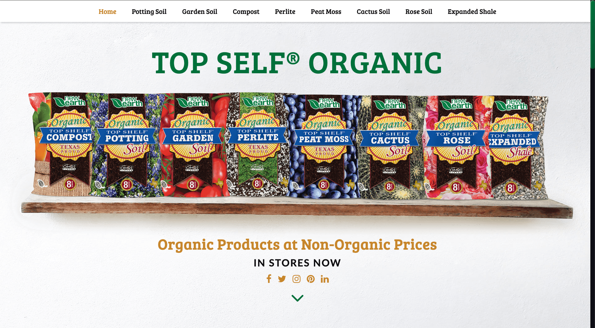

# Top Shelf® Organic – Eleventy Rebuild

Rebuilding the [**Top Shelf® Organic**](https://topshelforganic.com) page, originally built in wordpress, using the static site generator: [**Eleventy**](https://11ty.io/). The goal is to improve performance, accesibility and reduce bloat while learning how to use **Eleventy**. The site will be deployed in [**Netlify**](https://netlify.com) and will use advantage of [**Netlify CMS**](https://www.netlifycms.org/).

